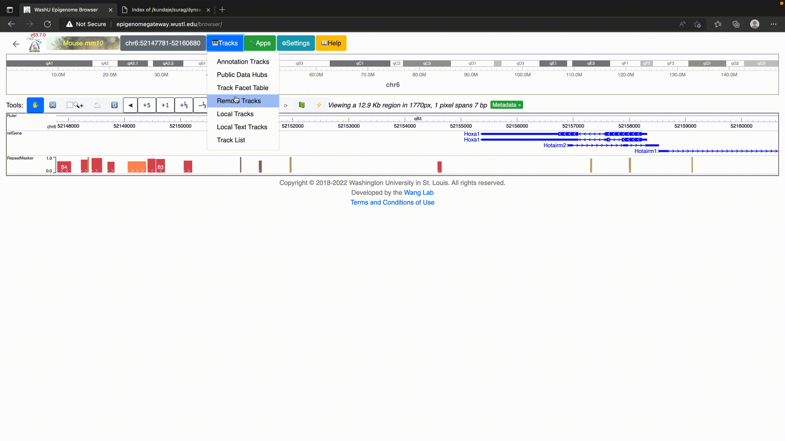
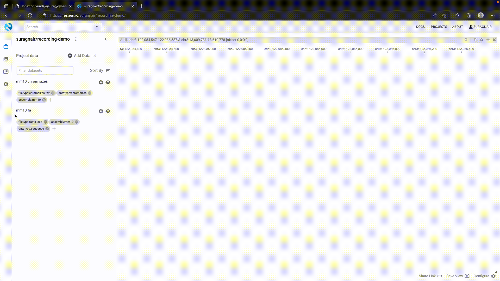

## dynseq tracks

The dynseq genome browser track displays nucleotide characters scaled by user-specified, base-resolution scores provided in the BigWig format. It is currently supported by the [WashU Epigenome Browser](https://epigenomegateway.wustl.edu/browser/), [UCSC Genome Browser](https://genome.ucsc.edu), and [HiGlass/Resgen](https://higlass.io). Instructions and details are provided below.

### WashU Epigenome Browser

To use dynseq tracks on the [WashU Epigenome Browser](https://epigenomegateway.readthedocs.io/en/latest/tracks.html#dynseq), simply load in the BigWig file using the "dynseq" track option as below.



### UCSC Genome Browser

The UCSC Browser treats the dynseq track as a regular BigWig that requires `logo=on` to be specified.

It can be specified as:

```
track bigDataUrl=https://link.to.dynseq.bw type=bigWig logo=on visibility=full
```


### HiGlass/Resgen

The dynseq track has been implemented in [HiGlass](https://github.com/kundajelab/higlass-dynseq) and supported by [Resgen](https://resgen.io/).

In HiGlass/Resgen, a dynseq track is associated with a BigWig and a Fasta file. This allows visualizing variants by providing an alternate Fasta file. To use dynseq in Resgen, first load the genome Fasta and chromosome size tsv with appropriate tags. Then add the dynseq track as shown below.


